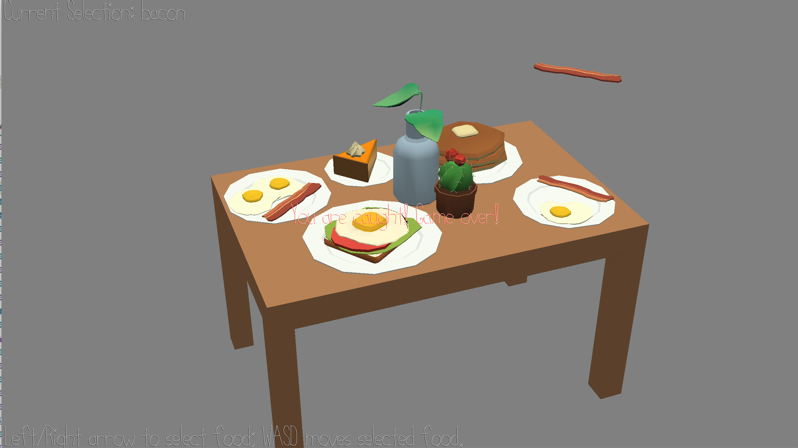

# Hungry Man

Author: qingyid

Design: feed the hungry man by stealing food when the light is off. When the light is on, the hostress catches the food stealer if he is half way through stealing the food.

Screen Shot:

How To Play:
Left/Right arrow: change selected food on the table
W/S: move food up or down; use W to steal the food; use S to get the food back to it's place before the light is switched on.

Sources: source blender file provided with the base code.

This game was built with [NEST](NEST.md).

